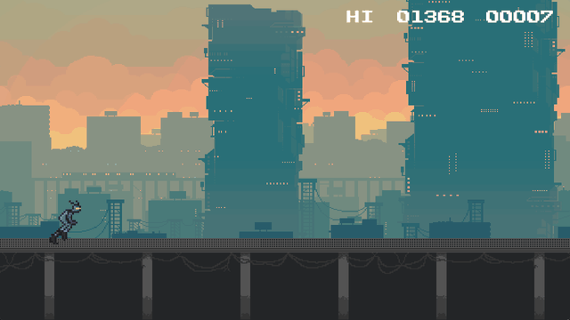
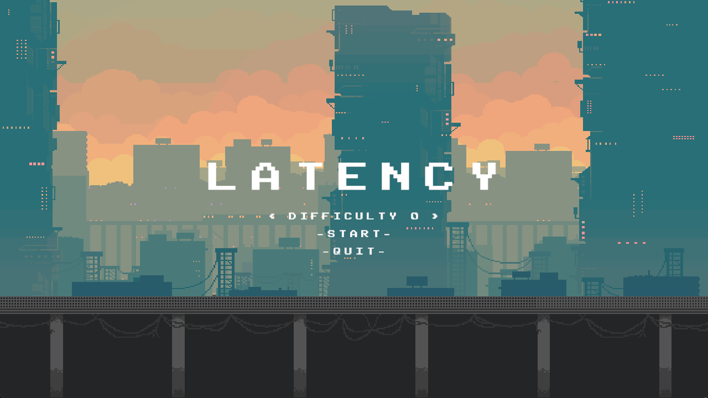
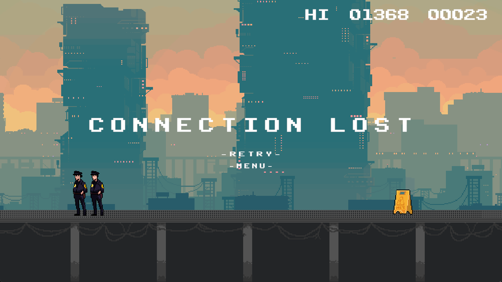
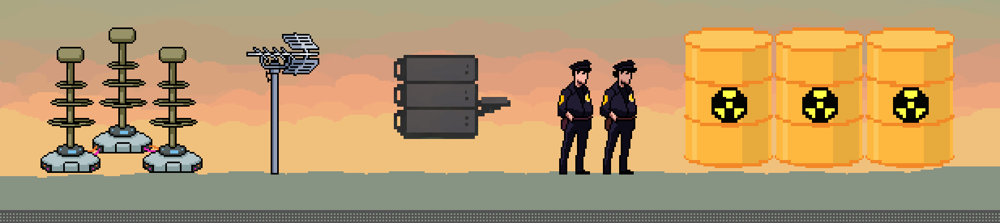
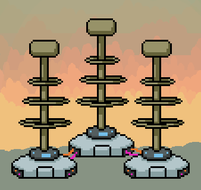
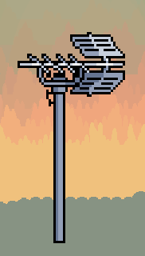
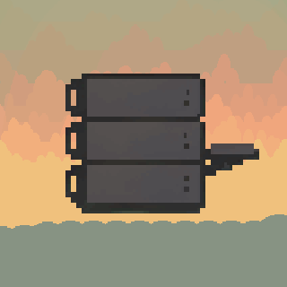
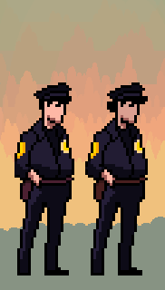
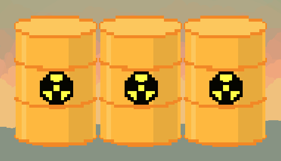
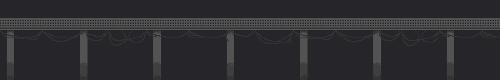

<div align="center">

# LATENCY

**An endless runner where your controls lag behind you — on purpose.**



Unity 6 &nbsp;·&nbsp; C# &nbsp;·&nbsp; 2D URP

</div>

---

## The idea

Every game fights to *remove* input lag. Latency turns it into the difficulty setting.

You're running across a rooftop catwalk through a cyberpunk city, jumping over hazards. Before each run you pick a **difficulty from 0 to 10**, and each step adds **100 ms of input delay** — up to a full second between pressing jump and your character actually jumping. At high settings you're not reacting anymore, you're *predicting*.

Higher latency means a bigger **score multiplier** (up to 5×), so the best scores go to players who can read the course ahead of time. Get hit and it's **CONNECTION LOST**.

| Main menu | Game over |
|:---:|:---:|
|  |  |

## Controls

| Action | Keys |
|---|---|
| Jump (hold for higher) | `Space` / `W` |
| Fast-fall | `S` / `↓` |
| Change difficulty | `<` `>` on the main menu |

## Original art

I drew all of the obstacles and the metal grating catwalk the player runs on, and designed the UI (title screen, difficulty selector, HUD and the CONNECTION LOST screen).



<table>
<tr>
<td align="center"><br><sub>Triple Tesla coil (animated)</sub></td>
<td align="center"><br><sub>Antenna (animated)</sub></td>
<td align="center"><br><sub>Server rack</sub></td>
</tr>
<tr>
<td align="center"><br><sub>Patrol officers</sub></td>
<td align="center" colspan="2"><br><sub>Hazardous waste barrels</sub></td>
</tr>
</table>


<p align="center"><sub>Metal grating ground tile (2400 px seamless strip, shown at 2×)</sub></p>

## How the latency works

The core mechanic lives in [`Player.cs`](Assets/Scripts/Player.cs). Each frame, raw input (jump pressed / held / released, down held) is timestamped and pushed onto a queue. The player only "sees" input once it's older than `inputDelayMs`:

```csharp
float delaySeconds = inputDelayMs * 0.001f;
while (inputQueue.Count > 0 && Time.time >= inputQueue.Peek().timestamp + delaySeconds)
{
    var nextInput = inputQueue.Dequeue();
    delayedInput.jumpPressed |= nextInput.jumpPressed;   // edge events are OR'd so a tap is never lost
    delayedInput.jumpReleased |= nextInput.jumpReleased;
    delayedInput.jumpHeld = nextInput.jumpHeld;          // held states take the latest value
    delayedInput.downHeld = nextInput.downHeld;
}
```

Because the whole input *stream* is delayed (not just the jump press), variable-height jumps still work: holding jump longer still jumps higher, just half a second late.

Other things I built on top of the base project:

- **Latency-scaled scoring:** [`GameManager.cs`](Assets/Scripts/GameManager.cs) maps input delay to a 1×–5× score multiplier
- **Main menu and difficulty selector:** [`MainMenuController.cs`](Assets/Scripts/MainMenuController.cs)
- **Multi-layer parallax city:** [`BackgroundParallax.cs`](Assets/Scripts/BackgroundParallax.cs), layers scrolling at different speeds tied to game speed
- **Music and SFX manager:** [`AudioManager.cs`](Assets/Scripts/AudioManager.cs) with menu/gameplay tracks and UI hover sounds
- **Jump buffering, variable jump height and fast-fall** for tighter game feel
- **Resolution-independent player placement**, so the runner stays in the same spot on any aspect ratio

## Running the project

1. Install **Unity 6000.0.27f1** (Unity 6) through Unity Hub.
2. Clone this repo and open the folder in Unity Hub.
3. Open `Assets/Scenes/DinoGame.unity` and press Play.

> The soundtrack isn't included in this repo because it's licensed, all-rights-reserved music. The game runs fine without it, just silently. The audio hooks are still in place, so tracks dropped into `Assets/Music/` with the same file names are picked up automatically.

## Credits

- **Base project:** [Zigurous — Unity Dino Game Tutorial](https://github.com/zigurous/unity-dino-game-tutorial) (starting point for the runner, spawner and ground scroll)
- **Music (used locally, not distributed):** [*16-Bit Adventure*](https://amynedd.bandcamp.com/album/16-bit-adventure) by **Amynedd**
- **Font:** [Public Pixel](https://ggbot.itch.io/public-pixel-font) by GGBotNet
- **Background layers, player sprite and wet-floor sign:** third-party asset packs
- **Obstacle art, metal grating and UI design:** me

---

<sub>Related: my research on input latency at the hardware level → [mouse-polling-latency](https://github.com/Craz33matt/mouse-polling-latency)</sub>
